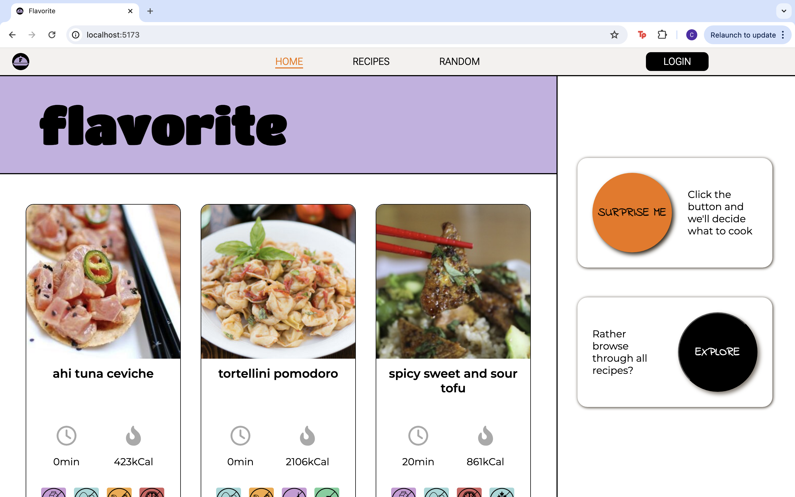

# Flavorite

## Inleiding 

Flavorite is een webapplicatie met recepten. De webapplicatie focust zich op het zoeken naar recepten die voldoen aan bepaalde wensen, bijvoorbeeld diëten of vrij van bepaalde allergenen. De recepten worden opgehaald van de API Edamam

## Applicatie starten

Als het project gecloned is naar de locale machine, installeer je eerst de `node_modules` door het volgende
commando in de terminal te runnen

`npm install`

Wanneer dit klaar is, kun je de applicatie starten met behulp van:

`npm run dev`

... of gebruik de WebStorm knop (npm run dev). 

Open http://localhost:5173 om de pagina in de browser te bekijken. 
